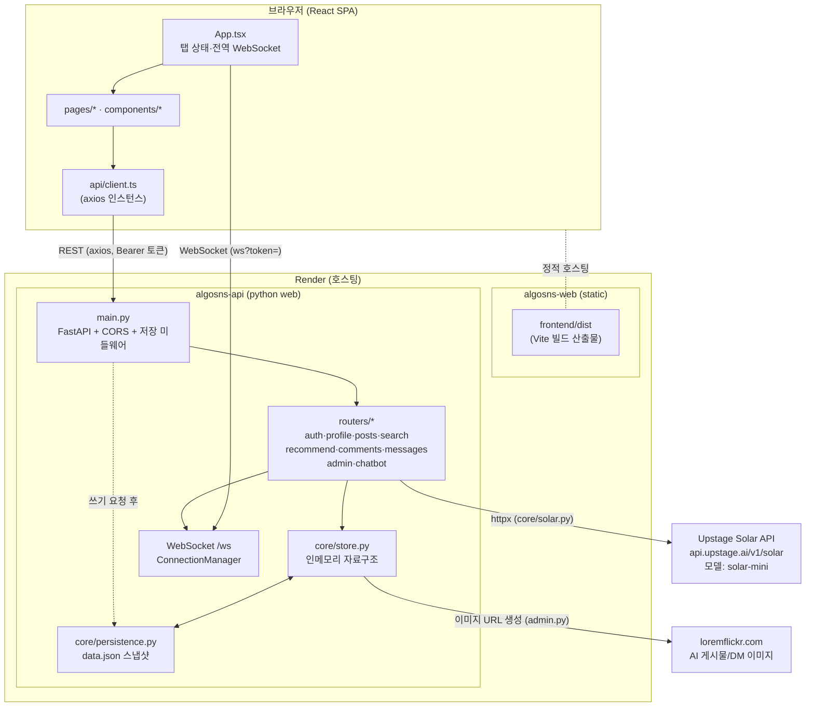

# WhaleGram (whale_algorithm) 기술 보고서

> 대상 브랜치: `deploy`
> 작성 기준: 저장소 실제 코드 (추측 배제, 모든 주장에 `파일:라인` 근거 표기)
> 앱 메타: `FastAPI(title="WhaleGram", version="0.3.0")` — `backend/main.py:43`
> README 표기명은 "AlgoSNS" (`README.md:1`)이나 코드/UI상 제품명은 "WhaleGram"

---

## 1. 시스템 아키텍처

### 1.1 구성요소 데이터 흐름

> 두 서비스는 `render.yaml`에 정의됨: `algosns-api`(python web, `rootDir: backend`)와 `algosns-web`(static, `rootDir: frontend`) — `render.yaml:1-30`. 서로의 주소를 환경변수로 주입(`VITE_API_BASE_URL`, `ALLOWED_ORIGINS`) — `render.yaml:14-15,24-25`.

### 1.2 각 컴포넌트의 역할

| 컴포넌트 | 역할 | 근거 |
|----------|------|------|
| `App.tsx` | 로그인 상태·탭 라우팅(URL 라우터 아님, `useState<Tab>`)·**단일 전역 WebSocket** 유지·알림 토스트 수신 | `frontend/src/App.tsx:53,155-210` |
| `api/client.ts` | axios 인스턴스, `localStorage` 토큰을 `Authorization: Bearer`로 자동 주입 | `frontend/src/api/client.ts:6-22` |
| `main.py` | FastAPI 앱 생성, CORS, **쓰기 요청마다 전체 저장** 미들웨어, lifespan 시드 | `backend/main.py:43-83` |
| `core/store.py` | 전역 인메모리 스토어(직접 구현 자료구조 인스턴스) | `backend/core/store.py:12-33` |
| `core/persistence.py` | `data.json`으로 직렬화/복원(임시파일 후 `os.replace` 원자적 교체) | `backend/core/persistence.py:18-37` |
| `core/solar.py` | Upstage Solar LLM 호출 클라이언트 | `backend/core/solar.py:13-46` |
| `routers/messages.py` | DM REST + WebSocket `/ws` + 알림 push + AI 자동응답 | `backend/routers/messages.py:46-81,284-339` |
| `routers/admin.py` | AI 페르소나 정의·시딩·이미지 URL·관심분야 매핑 | `backend/routers/admin.py:77-298` |

### 1.3 핵심 상호작용 흐름 (예: 게시물 작성)

1. `POST /posts` 수신 — `backend/routers/posts.py:48-105`
2. 본문으로 Solar 해시태그 추출(`solar.extract_hashtags`) — `posts.py:72`
3. `post_store`(HashTable) 저장 + `feed_tree`(BST)에 `(created_at, post.id)` 삽입 + `tag_index` 갱신 — `posts.py:84-90`
4. 본문 `@멘션` 대상에게 WebSocket 알림 push — `posts.py:92-104`
5. 응답 후 미들웨어가 `persistence.save_all()` 호출(2xx + 변경 메서드) — `backend/main.py:61-69`

---

## 2. 기술 스택

### 2.1 백엔드 (`backend/requirements.txt`)

| 기술 | 버전 | 용도·선택 근거 |
|------|------|----------------|
| Python | Render에서 `3.12` 핀 | `render.yaml:10-11` (참고: 로컬 캐시는 `cpython-314.pyc`로 3.14 흔적 — 로컬/배포 버전 상이, **확인 필요**) |
| FastAPI | `0.115.0` | REST + WebSocket + 의존성 주입. `Depends(auth.get_current_user)`로 토큰 검증 — `backend/routers/posts.py:51` |
| uvicorn[standard] | `0.32.0` | ASGI 서버. 시작 명령 `uvicorn main:app` — `render.yaml:8` |
| httpx | `0.27.2` | **비동기** Solar 호출(`httpx.AsyncClient`) — `backend/core/solar.py:31-41` |
| python-dotenv | `1.0.1` | `.env`에서 `SOLAR_API_KEY` 로드 — `backend/main.py:9-11`, `core/solar.py:5` |
| pydantic | `2.9.2` | 요청 본문 검증(`BaseModel`) — 전 라우터 |

데이터베이스는 **사용하지 않음**. 대신 직접 구현한 자료구조를 전역 인메모리로 사용 — `backend/core/store.py:12-33`, README도 "DB 없음 — 서버 인메모리 자료구조"로 명시 `README.md:12`.

### 2.2 프런트엔드 (`frontend/package.json`)

| 기술 | 버전 | 용도·근거 |
|------|------|----------|
| React | `^19.2.6` | SPA UI. `StrictMode` 사용 — `frontend/src/main.tsx:7-9` |
| react-dom | `^19.2.6` | DOM 렌더 |
| Vite | `^8.0.12` | 번들러/dev 서버. 빌드 `tsc -b && vite build` — `package.json:8` |
| TypeScript | `~6.0.2` | 정적 타입 |
| axios | `^1.16.1` | REST 클라이언트 — `frontend/src/api/client.ts:1` |
| react-router-dom | `^7.15.1` | **의존성에 존재하나 `src/`에서 import 없음** → 실사용 안 함(라우팅은 탭 `useState`) — `App.tsx:34,53` (사용처 grep 결과 없음) |
| eslint 10 / typescript-eslint 8 | dev | 린트 — `package.json:18-31` |

빌드 산출물(`dist`)을 static으로 게시 — `render.yaml:19-22`. SPA 라우팅 폴백 `rewrite /* → /index.html` — `render.yaml:26-29`.

### 2.3 인프라 / 배포

- **호스팅**: Render. `render.yaml`로 IaC. free 플랜 — `render.yaml:5`.
- **CI/CD**: `.github` 등 워크플로 파일 **없음**(저장소 내 미존재). 배포는 Render의 `deploy` 브랜치 자동 빌드에 의존(설정값은 대시보드, **확인 필요**).
- **컨테이너**: Dockerfile / docker-compose **없음**.
- **테스트**: `pytest` 단위 테스트(자료구조 6종) — `tests/test_*.py`, 실행 시 61 passed(확인됨). 라우터/통합 테스트는 없음.
- **비밀값**: `SOLAR_API_KEY`는 `sync: false`로 코드에 비포함, Render에 수동 주입 — `render.yaml:12-13`, `.env.example:1`.

---

## 3. LLM 사용 방법

### 3.1 모델·엔드포인트·호출 방식

- **공급자/모델**: Upstage Solar, 모델명 하드코딩 `"solar-mini"` — `backend/core/solar.py:36`.
- **엔드포인트**: `https://api.upstage.ai/v1/solar` + `/chat/completions` — `solar.py:6,33`.
- **호출 핵심**: 단일 비동기 함수 `chat(prompt, temperature, system, history)` — `solar.py:13-46`.
  - OpenAI 호환 chat 포맷(`messages` 배열, `system`/`user`/`assistant`) — `solar.py:21-30`.
  - 인증 `Authorization: Bearer {SOLAR_API_KEY}` — `solar.py:34`.
  - **타임아웃 25초** — `solar.py:40`.
  - 미설정 시 `RuntimeError` 또는 안내 문자열 반환 — `solar.py:19-20,99-100,147-148`.

### 3.2 호출 지점(목적별) — 실제 사용되는 것

| 함수 | 목적 | temperature | 호출 위치 |
|------|------|-------------|-----------|
| `extract_hashtags` | 게시물 본문 → 해시태그 3개 | 기본 0.3 | `backend/routers/posts.py:72` |
| `extract_interests` | 소개글 → 관심사 ≤5개 | 기본 0.3 | `backend/routers/profile.py:156` (`PATCH /users/{username}/bio`) |
| `expand_keywords` | 검색어 → 연관 키워드 5개 | 기본 0.3 | `backend/routers/search.py:80` (`GET /search/expand`) |
| `persona_reply` | AI 유저의 DM 자동 응답 | **0.85** | `backend/routers/messages.py:116` (`_maybe_ai_reply`) |
| `chatbot_answer` | 가이드 봇 응답 | **0.5** | `backend/routers/chatbot.py:45` (`POST /chatbot/ask`) |

### 3.3 프롬프트 설계 / 컨텍스트 구성

- **시스템 프롬프트로 페르소나 고정**(AI DM): 이름·자기소개·성격 특질을 system에 주입, "AI라는 말은 절대 하지 마" 지시 — `solar.py:102-108`. 성격 특질은 `PERSONAS[*].personality`에서 조회 — `messages.py:113-114`, `admin.py:607-611`.
- **가이드 봇 RAG-유사 컨텍스트**: 정적으로 조립한 앱 설명 문자열을 system 뒤에 첨부(`=== 컨텍스트 ===`) — `solar.py:150-156`, 컨텍스트 빌더 `chatbot.py:20-35`. 외부 검색/임베딩 없음 → **벡터 RAG 아님**, 하드코딩 문맥.
- **대화 맥락 유지**: 프런트가 직전 턴(`history`)을 함께 전송 → `chat()`이 `messages`에 펼침 — `chatbot.py:44`, `solar.py:24-29`. 봇 세션은 서버에 보관(`/me/bot_sessions`) — `backend/routers/auth.py:81-96`.

### 3.4 출력 파싱

- **JSON 파싱 의존**: `extract_*`/`expand_keywords`/`generate_persona`는 모델 텍스트를 그대로 `json.loads` — `solar.py:54,65,76,87,124`.
- **방어**: 예외 시 빈 배열/딕셔너리 반환(스키마 검증·재시도 없음) — `solar.py:55-57,66-68,77-79`.
- **자유 텍스트 후처리**: `persona_reply`/`generate_post_for_persona`는 `strip`/따옴표 제거 — `solar.py:110,138`.

### 3.5 비용 / 지연 / 안정성 처리

- **지연**: 고정 타임아웃 25초 외 별도 처리 없음 — `solar.py:40`. AI DM은 백그라운드 태스크로 분리(`asyncio.create_task`)되어 응답 블로킹 방지 — `messages.py:191,335`.
- **안정성**: 비200 응답 로깅 후 `raise_for_status` — `solar.py:42-44`. 상위 호출부는 try/except로 폴백 문자열/빈 결과 — 각 함수.
- **비용/토큰**: **토큰 카운팅·비용·캐싱·레이트리밋 로직 없음**(코드상 부재). `max_tokens` 미지정 — `solar.py:35-39`.
- **재시도/서킷브레이커**: 없음.

### 3.6 정의되었으나 호출되지 않는 LLM 코드 (죽은 코드)

- `solar.analyze_interests` — `solar.py:82`, 사용처 없음(grep: 정의/로그만).
- `solar.generate_persona` — `solar.py:116`, 사용처 없음. 시딩은 LLM 없이 정적 `PERSONAS`/`FALLBACK_POSTS_BY_USERNAME` 사용 — `admin.py:450-526`.
- `solar.generate_post_for_persona` — `solar.py:130`, 사용처 없음.
- `admin.get_persona_photo_prompt` — `admin.py:614`, 사용처 없음(이미지가 Pollinations→loremflickr로 교체되며 `photo_prompt` 미사용 — `admin.py:33-34`).

---

## 4. 주요 구현 세부 사항

### 4.1 직접 구현 자료구조 → 기능 매핑

| 자료구조 | 구현 | 사용 기능 | 근거 |
|----------|------|-----------|------|
| HashTable (djb2 + 체이닝, 고정 size 1024, **리사이즈 없음**) | `algorithms/hash_table.py:1-53` | 유저/포스트/댓글/메시지 저장 | `core/store.py:12-21` |
| BST (key=`(timestamp, post_id)`) | `algorithms/bst.py:8-73` | 피드 타임라인 정렬(`inorder` 후 역순) | `routers/posts.py:200-211` |
| Trie | `algorithms/trie.py:8-56` | 유저명 자동완성 | `routers/search.py:42-44` |
| KMP (failure function) | `algorithms/kmp.py:1-29` | 게시물 본문 검색 | `routers/search.py:58` |
| Graph (인접집합) + BFS + Dijkstra | `algorithms/graph.py:1-145` | 팔로우 그래프·사람 추천·인맥 경로/거리 | `routers/recommend.py:233,262,291` |
| MaxHeap | `algorithms/heap.py:1-57` | **import만 되고 추천 경로에서 미사용** (4.6 참조) | `store.py:9`, `recommend.py:6` |

### 4.2 피드 타임라인 (BST)

- 게시 시 `feed_tree.insert((created_at, post_id))` — `routers/posts.py:85`.
- 조회 시 `feed_tree.inorder()`를 `reversed`로 순회하며 `following ∪ 본인` 작성자만 필터 — `routers/posts.py:199-211`.
- `BST.range_query`(시간 구간) 구현은 있으나 라우터에서 미사용(`bst.py:59-73`).

### 4.3 검색 (Trie + KMP + 태그 역인덱스)

- 유저명: `search_trie.search(prefix)`로 접두사 하위 전체 수집 — `trie.py:21-35`, `search.py:42-44`.
- 게시물: 먼저 `tag_index`(해시태그 역인덱스) 매칭, 이후 전체 게시물 본문에 `kmp_search` 선형 스캔 — `search.py:54-59`.
- 점수화: 태그 일치 +3, 좋아요×0.1로 정렬 — `search.py:67-71`.
- Solar 확장 검색: `expand_keywords` 결과까지 합쳐 재검색 — `search.py:80-100`.

### 4.4 추천 (Graph)

- **사람 추천**(`GET /recommend/people/{username}`): 최근 가입 실제 유저 + 관심분야 매칭 AI + `social_graph.bfs_recommend(depth=2)` 공통 친구 — `recommend.py:168-251`.
  - BFS는 2-홉 내 비팔로우 노드의 "공통 친구 수"(이웃 ∩ 내 팔로잉) 계산 — `graph.py:21-42`.
- **가까운 친구**(`GET /recommend/closest/{username}`): `dijkstra_all`로 가중 최단거리, **간선 가중치 `1/(공통 관심사 수 + 1)`** → 관심사 겹칠수록 가까움 — `graph.py:95-145`, `recommend.py:277-320`.
- **인맥 경로**(`GET /recommend/path/...`): `dijkstra_path`로 두 유저 간 경로 — `graph.py:44-93`, `recommend.py:254-274`.
- Dijkstra는 우선순위 큐 대신 **선형 최소 탐색**(O(V²)) — `graph.py:55-61,109-114`.

### 4.5 인증·세션·영속화

- 비밀번호: `PBKDF2-HMAC-SHA256`, 반복 100,000, 유저별 16바이트 salt, `salt$digest` 저장 — `core/auth.py:13-29`.
- 토큰: `secrets.token_urlsafe(32)` → 인메모리 `token_store: dict` — `auth.py:8,32-35`. `data.json`의 `"tokens"`로 영속 — `persistence.py:31,74`.
- 검증: 헤더 `Bearer` 파싱(`get_current_user` / `_optional`) — `auth.py:42-56`.
- 영속화: 모든 스토어를 `asdict`로 직렬화해 `data.json` 기록, 임시파일 후 `os.replace` — `persistence.py:18-37`. **쓰기(POST/PUT/PATCH/DELETE) 2xx 응답마다** 전체 저장 — `main.py:58-69` + 종료 시 저장 — `main.py:40`.
- `data.json`은 `.gitignore` 대상(리포 미포함) — `.gitignore:6`.

### 4.6 실시간 메시지·알림 (WebSocket)

- 단일 엔드포인트 `/ws?token=` — 쿼리 토큰으로 인증, `ConnectionManager.active: dict[user_id, WebSocket]` — `messages.py:46-69,284-292`.
- 프런트는 **앱 전역 1개 소켓**만 유지하고 모든 탭이 공유 — `App.tsx:155-210`.
- 메시지 송신: WS 수신 → 저장 → 수신자에게 `type:"message"`, 송신자에게 `type:"echo"` — `messages.py:309-333`.
- AI 자동응답: 수신자가 `is_ai`면 `persona_reply` 생성, 사진 요청 키워드면 loremflickr 이미지 첨부 — `messages.py:107-153`, 키워드 `messages.py:17-30`.
- **알림 push**(`push_notification`): `type:"notification"` + `kind/from_username/content/post_id/comment_id/created_at`. **수신자가 현재 연결돼 있을 때만 전달**(오프라인이면 유실, 영속 저장 없음) — `messages.py:57-66,77-81`.
- 알림 종류·근원: 댓글(`comment`)·답글(`reply`)·언급(`mention`), 각 `comment_id` 포함(본문 멘션은 `None`) — `routers/comments.py:26-44,107-108,138-139`, `routers/posts.py:97-104`.

### 4.7 프런트 알림 토스트 (최근 구현)

- 우하단에서 위로 쌓임(`flex-direction: column-reverse`), CSS `wg-rise` 애니메이션 — `components/Notifications.tsx:118-141`, `index.css:36-43`.
- **우선순위 병합**: 같은 근원(`post_id|comment_id|from_username`)이면 `comment(1)<reply(2)<mention(3)` 중 최고만 표시 — `Notifications.tsx:38-42,300-339`.
- 설정(localStorage `wg_notif_settings`): 모두 끄기·유지시간 1~15초·종류별 표시여부/투명도(0~100%)/소리/음량 — `Notifications.tsx:20-46,150-300`.
- 알림 클릭 → `GET /posts/{id}`로 단일 게시물 로드 후 모달에서 해당 댓글로 스크롤·강조 — `components/PostFocusModal.tsx`, `components/PostCard.tsx`(`highlightCommentId`), `routers/posts.py:170-181`(신규 엔드포인트).

### 4.8 AI 페르소나 시딩

- 20종 페르소나(정적 정의: username·bio·personality·tags·이미지키워드) — `admin.py:77-258`.
- 시작 시 lifespan에서 누락분만 top-up 시딩 + 이미지/관심사 백필 + 옛 이름 정리 — `main.py:16-39`, `admin.py:450-604`.
- 이미지: `loremflickr.com/512/512/{tag}?lock=md5(seed)`로 고정(Pollinations 동시성 제한 때문에 교체) — `admin.py:33-64`.
- 관심분야 라벨 ↔ 페르소나 매핑으로 추천 연결 — `admin.py:263-297`.

---

## 5. 제한 사항

### 5.1 데이터 영속성·배포 (가장 중요)

- **단일 프로세스 인메모리 + 파일 스냅샷**: 모든 상태가 한 프로세스 메모리에 존재 — `core/store.py`. `data.json`으로만 영속하며 리포에 미포함(`.gitignore:6`).
- **Render free 플랜의 임시 파일시스템**: 재배포/재시작 시 디스크가 초기화되는 것이 일반적 → `data.json`이 보존되지 않아 **사용자 데이터가 초기화될 수 있음**(정확한 디스크 영속 정책은 Render 설정 의존, **확인 필요**). 실제로 시작 시 AI 유저를 재시드하도록 설계됨 — `main.py:16-39`.
- **무료 플랜 슬립**: 유휴 시 인스턴스가 잠들어 재기동 콜드스타트 발생 가능(플랫폼 동작, **확인 필요**).

### 5.2 성능·확장성

- **매 쓰기마다 전체 스냅샷 저장**: `save_all()`이 전체 유저/포스트/댓글/메시지를 `asdict`+JSON 직렬화 → 쓰기 1건당 O(전체 데이터) — `main.py:61-69`, `persistence.py:18-37`. 데이터 증가 시 쓰기 지연 급증.
- **빈번한 O(n) 선형 스캔**: HashTable이 `username` 키 기반이라 **`user_id→user` 조회가 매번 전체 순회**. 예: `_username_of`(`comments.py:19-23`), `_id_to_username`(`messages.py:89-93`), `_user_by_id`(`auth.py:20-24`), 다수 라우터에서 `user_store.values()` 반복.
- **HashTable 고정 크기 1024·리사이즈 없음**: 항목이 1024를 크게 넘으면 버킷 체인이 길어져 조회가 O(n)에 근접 — `hash_table.py:2,7-12`.
- **Dijkstra O(V²)**: 우선순위 큐 미사용(선형 최소 탐색) — `graph.py:55-61`. 소규모에선 무방, 대규모 그래프엔 부적합.
- **검색 본문 매칭 전수 스캔**: `kmp_search`를 모든 게시물에 적용 — `search.py:57-59`.
- **Trie.search 무제한 수집**: 접두사 하위 모든 단어 수집(상한 없음) — `trie.py:31-35`. 프런트에서 8개로 자르지만 서버는 전부 반환 — `search.py:44`.

### 5.3 LLM 관련

- **출력 파싱 취약성**: 모델 응답을 `json.loads`로 직접 파싱, 스키마 검증·재시도·부분 파싱 없음. 형식 이탈 시 조용히 빈 결과 — `solar.py:54-57,64-68`.
- **비용·레이트리밋 부재**: 토큰/비용 추적, 캐싱, 호출 제한 없음. `/search/expand`, `/chatbot/ask` 등은 인증 없이도 호출 가능 → 외부 비용 유발 가능(`search.py:75-79`는 `_optional` 인증).
- **`max_tokens` 미설정**: 응답 길이 상한 없음 — `solar.py:35-39`.

### 5.4 실시간·알림

- **오프라인 알림 유실**: `push_notification`은 연결된 수신자에게만 전송, 영속 알림 저장소 없음 → 미접속 중 발생한 알림은 사라짐 — `messages.py:57-66`.
- **WebSocket 토큰을 URL 쿼리로 전달**: `/ws?token=` — 중간 로그/프록시에 토큰 노출 위험 — `messages.py:286`, `client.ts:268-271`.
- **알림 우선순위 병합의 그룹 키**: `from_username` 기반 — 동명이인은 없으나(유저명 유일) 본문 멘션은 `comment_id=None`이라 같은 작성자의 서로 다른 게시물 본문 멘션이 한 그룹으로 병합될 수 있음 — `Notifications.tsx:301-303`(엣지 케이스, **확인 필요**).

### 5.5 보안·인증

- **토큰 무만료**: `token_store`에 만료/TTL 없음, 로그아웃 시에만 폐기 — `auth.py:32-39`. `data.json`에 평문 영속 — `persistence.py:31`.
- **비밀번호 최소 4자**: 약한 정책 — `profile.py:42-43`.
- **CORS**: `allow_credentials=True`로 명시 오리진 허용, `allow_methods/headers=["*"]` — `main.py:49-55`.

### 5.6 코드 정합성(문서/구현 불일치 및 죽은 코드)

- **Max-Heap 미사용**: README·가이드봇 컨텍스트는 "추천 게시글 Top-K에 Max-Heap"이라고 기술(`README.md:23`, `chatbot.py:24`)하나, 실제 `recommend.py`는 `list.sort`+슬라이싱으로 정렬하며 `MaxHeap`을 인스턴스화하지 않음 — `recommend.py:73-74`. import만 존재 — `recommend.py:6`, `store.py:9`.
- **죽은 LLM 함수**: `analyze_interests`/`generate_persona`/`generate_post_for_persona`(`solar.py:82,116,130`), `get_persona_photo_prompt`(`admin.py:614`) 호출처 없음.
- **미사용 의존성**: `react-router-dom`이 `package.json:16`에 있으나 `src/`에서 import 없음(라우팅은 탭 상태).
- **README 경로 드리프트**: `/users/{username}/feed`로 표기(`README.md:69`)되나 실제 라우트는 `/feed/{username}` — `posts.py:190`. 테스트 수도 "50개"로 표기(`README.md:112`)되나 실제 61개.
- **버전 환경 차이**: Render는 Python 3.12 핀(`render.yaml:11`), 로컬 캐시는 3.14(`__pycache__/*.cpython-314.pyc`) — 빌드 환경 불일치 가능, **확인 필요**.

### 5.7 미구현·범위 밖

- URL 라우팅/딥링크 없음(탭 상태만) — 새로고침 시 첫 탭으로 복귀.
- 게시물 단건 페이지 없음(알림 클릭은 모달로 대체) — `PostFocusModal.tsx`.
- 라우터/통합 테스트 없음(자료구조 단위 테스트만) — `tests/`.
- 페이지네이션 없음: 피드/검색/추천이 전체를 메모리에서 처리.

---

### 부록 A. 라우터 인벤토리

`auth`·`profile`·`posts`·`search`·`recommend`·`comments`·`messages`·`admin`·`chatbot` 9개를 `main.py:72-82`에서 등록. 루트 헬스체크 `GET /` — `main.py:85-87`.

### 부록 B. 검증 방법

- 프런트: `npm run build`(tsc + vite) 성공.
- 백엔드: `import main` 성공 및 라우트 등록 확인, `pytest` 61 passed.
- 본 보고서 주장은 위에 인용한 `파일:라인`을 직접 읽어 작성함.
